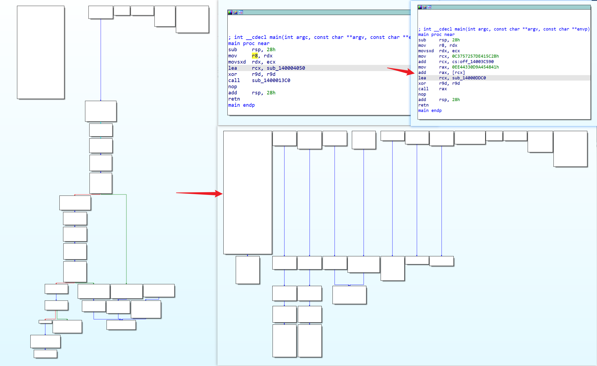

# ollvm-rust

集成 llvm obfuscation pass 的 rust 工具链，可在编译时直接生成混淆的二进制文件，支持以下混淆方式：

- 混淆过程间相关
- 间接跳转,并加密跳转目标(-mllvm -irobf-indbr)
- 间接函数调用,并加密目标函数地址(-mllvm -irobf-icall)
- 间接全局变量引用,并加密变量地址(-mllvm -irobf-indgv)
- 字符串(c string)加密功能(-mllvm -irobf-cse) （rust 中不生效，已知问题）
- 过程相关控制流平坦混淆(-mllvm -irobf-cff)
- 全部 (-mllvm -irobf-indbr -mllvm -irobf-icall -mllvm -irobf-indgv -mllvm -irobf-cse -mllvm -irobf-cff)

混淆插件提取自 [Arkari](https://github.com/KomiMoe/Arkari) 项目。

> 注意：该项目当前仅在 windows x86 下测试，其他平台未测试



## 当前适配版本

具体到小版本，别的版本不保证兼容

|rust|rust-llvm|llvm|
|--|--|--|
|[1.79.0](https://github.com/rust-lang/rust/tree/1.79.0)|[rustc/18.1-2024-05-19](https://github.com/rust-lang/llvm-project/tree/rustc/18.1-2024-05-19)|[llvmorg-18.1.7](https://github.com/llvm/llvm-project/tree/llvmorg-18.1.7)|

## x86_64-pc-windows-msvc 工具链

### 环境

- Windows 11 (10.0.22631.3737)
- Git 2.45
- Python 3.11
- Visual Studio 2022 (17.10.3)
  - 使用 C++ 的桌面开发
  - 单个组件 （如果编译出现问题，比如找不到 crt 相关的头，尝试安装下面的组件）
    - Windows 通用 C 运行时
    - Windows 10 SDK (10.0.20348.0)
    - Windows 通用 CRT SDK

### 编译

需在 `x64 Native Tools Command Prompt for VS 2022` 环境中执行，从开始菜单或者执行 `cmd.exe /k "C:\Program Files\Microsoft Visual Studio\2022\Community\Common7\Tools\VsDevCmd.bat" -startdir=none -arch=x64 -host_arch=x64` 进入：

```bash
git clone --branch 1.79.0 https://github.com/0xlane/ollvm-rust.git
cd ollvm-rust
git submodule update --init rust
cd rust
copy ..\config.toml .\
python x.py check
git apply —unsafe-paths -p1 --directory=.\src\llvm-project ..\18.1-2024-05-19.patch
python x.py build
```

此过程大概需要 40 分钟左右，完成后在 `build\x86_64-pc-windows-msvc` 目录查看编译生成的文件。

也可以和其他教程一样仅编译 llvm：

```bash
# After apply patch file
cd src\llvm-project
cmake -G "Ninja" -S . -B ./build_dyn_x64 -DCMAKE_INSTALL_PREFIX=./llvm_x64 -DCMAKE_CXX_STANDARD=17 -DCMAKE_BUILD_TYPE=Release -DLLVM_ENABLE_PROJECTS="clang;clang-tools-extra;lld;lldb;" -DLLVM_TARGETS_TO_BUILD="X86" -DLLVM_INSTALL_UTILS=ON -DLLVM_INCLUDE_TESTS=OFF -DLLVM_BUILD_TESTS=OFF -DLLVM_INCLUDE_BENCHMARKS=OFF -DLLVM_BUILD_BENCHMARKS=OFF
cd build_dyn_x64
ninja # or make
ninja install # or make install
```

llvm_x64 目录下就是编译好的 llvm，可以使用以下方法验证 pass 是否已经被编译到 llvm 中：

```bash
cd llvm_x64\bin
llvm-config.exe --components | findstr obfuscation
opt.exe --help | findstr Obfuscation
```

如果使用已经编译好的 llvm 再编译 rust，可以修改 rust 源码目录下的 `config.toml`，把 `llvm-config` 注释去掉，值修改为 `llvm-config.exe` 的实际路径：

```toml
llvm-config = "D:\\dev\\llvm-build\\build_dyn_x64\\bin\\llvm-config.exe"
```

然后执行 `python x.py build` 编译 rust，这个过程不会再去编译项目下的 llvm。

### 使用

我本来已经安装了 rust 环境，在执行完 `python x.py build` 之后自动帮我添加了生成的工具链：

```bash
PS > rustup toolchain list -v
stable-x86_64-pc-windows-msvc (default)
stage1
```

直接使用即可：

```bash
cargo new helloworld --bin
cd helloworld
cargo +stage1 rustc --target x86_64-pc-windows-msvc --release -- -C"llvm-args=-irobf-indbr -irobf-icall -irobf-indgv -irobf-cse -irobf-cff"
```

## 参考

- [Installing from Source](https://github.com/rust-lang/rust/blob/master/INSTALL.md)
- [rustc dev guide](https://rustc-dev-guide.rust-lang.org/building/how-to-build-and-run.html)
- [Windows rust使用LLVM pass](https://bbs.kanxue.com/thread-274453.htm)
- [Orust Mimikatz Bypass Kaspersky](https://b1n.io/posts/orust-mimikatz-bypass-kaspersky/)
- [Building LLVM with CMake](https://llvm.org/docs/CMake.html#developing-llvm-passes-out-of-source)
- [llvm-tutor](https://github.com/banach-space/llvm-tutor)
- [String encryption failed](https://github.com/joaovarelas/Obfuscator-LLVM-16.0/issues/8)

## 感谢

- [Arkari](https://github.com/KomiMoe/Arkari)
